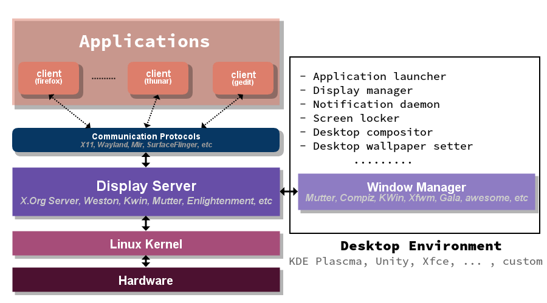

# Poweruser: i3 window manager
## by Olgierd &#34;Allgreed&#34; Kasprowicz
<!-- Wszelkie obrazki należą do ich właścicieli -->

Note:
node bower_components/reveal.js/plugin/notes-server/
Na ekranie nr 8


# <span style="color: #b58900">Disclaimer</span>
<!-- .slide: data-background-color="black" -->


## <span style="color: #b58900">Cykl PowerUser</span>
<!-- .slide: data-background-color="black" -->


## <span style="color: #b58900">Idea OpenSource</span>
<!-- .slide: data-background-color="black" -->


## <span style="color: #b58900">Hacker:Space</span>
<!-- .slide: data-background-color="black" -->


# Podstawy linuxowych DE




Note:
- To będzie mega ogólnie
- Kernel ma tylko teletype (tty)
- X dostarcza podstawę/framework do wyświetlnaia stuffu
- X jest w architekturze klient-serwer
- DE to wm + dodatki
- wm zarządza wyświetlaniem okien


## Demo time!

Note:
Na maszynie wirtualnej, odpalam TTY (F2), sekundę śmigam po terminalu, załączam X ```startx```, odpalam cosie, załączam Compiza ```compiz```


# Rodzaje menadżerów okien


## Stacking


## Floating


Note:
To samo, co stacking, tylko okna są buforowane, więc nie ma takich jaj ;)


## Tiling


## Tiling c.d.

### Manual
np. i3

### Dynamic
np. awesome

Note:
Man: User wskazuje położenie okna
Dyn: Okna wskakują "same", predefiniowane layouty


## Hybrid


Note:
Jak coś jest do wszystkiego to jest do niczego, w praktyce z floatowania się nie korzysta


# Czemu i3?


alopex, Awesome, bspwm, catwm, dswm, dwm, echinus, euclid-wm, FrankenWM, herbstluftwm, <span style="color: #b58900">i3</span>, Ion3, monsterwm, Musca, Notion, qtile, Ratpoison, Snapwm, Spectrwm, Stumpwm, sway, subtle, Wingo, WMFS, wmii, xmonad

Note:
Któryś trzeba wybrać


Note:
Popularność


```ps -eo rss,pid,euser,args:100 --sort %mem | grep -v grep | grep -i i3 | awk '{printf $1/1024 "MB"; $1=""; print }' | awk '{print $1}' | sed 's/.$//' | sed 's/.$//' | python -c "import sys; print(sum(float(l) for l in sys.stdin))"
```

|       wm       |   RAM   |
|:--------------:|:-------:|
|       i3       | ~ 25 MB |
| compiz (Unity) | ~ 85 MB |
|    cinnamon    | ~ 85 MB |

Note:
(Skrypt do zmierzenia ilości zużywanego RAMu przez i3). DE zużywają do 500mb RAMu. Nie ma to znaczenia dla RAMu, ale ma dla baterii w laptopach.


Note:
Otwarta licencja


# Demo time!

Note:
U mnie:
- Przeskakiwanie po workspace'ach
- Okna w 1 workspacie
- Bar
<!-- Głęboki nur -->
<!-- Podstawy konfiguracji i3 -->


# Jak znaleźć klawisze


## scancodes


## keycodes

```xev | awk -F'[ )]+' '/^KeyPress/ { a[NR+2] } NR in a { printf "%-3s %s\n", $5, $8 }'```


## keysyms

```xev | sed -n 1~2p -u | awk '/keysym/ {print substr($7, 1, length($7)-2)}'```


<!-- Adding i3 status -->
<!-- - Bonus: jak połącyć się z wifi z konsoli ;) -->


Questions? :)

<!-- Ciekawe linki -->
- [1st demo inspiration](https://www.youtube.com/watch?v=4J5snV2wjtw)
- [Window managers comparison](https://wiki.archlinux.org/index.php/Comparison_of_tiling_window_managers)
- [Window managers memory consumption](https://askubuntu.com/questions/181370/how-heavy-on-resources-is-cinnamon-desktop-environment)
- [Scancodes, keycodes, keysyms theorys](http://www.tldp.org/HOWTO/BackspaceDelete/actions.html)
- [More on keycodes and keysyms](https://wiki.archlinux.org/index.php/extra_keyboard_keys)

Materiały:
http://walther.io/how-to-replace-unity-with-i3-window-manager-on-ubuntu-1204/
https://i3wm.org/screenshots/
https://fedoramagazine.org/getting-started-i3-window-manager/
https://i3wm.org/docs/userguide.html