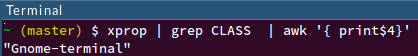

# Poweruser: i3 window manager
## by Olgierd &#34;Allgreed&#34; Kasprowicz

Note:
node bower_components/reveal.js/plugin/notes-server/
Na workspacie nr 8


# <span style="color: #b58900">Disclaimer</span>
<!-- .slide: data-background-color="black" -->

Note:
Polecam ściągnąć sobie presentation.md z Githuba, żeby nie przepisywać dużej ilości komend. Link na meetupie.
Moje opinie są moje, a nie mojego pracodawcy lub podmiotów, w których jestem udziałowcem.


## <span style="color: #b58900">Power User</span>
<!-- .slide: data-background-color="black" -->

Note:
Mam nadzieję zastartować cykl. Jak ktoś z was coś umie fajnego to zapraszam do pokazania. Chętnie się nauczę. Power user to użytkownik, który nie boi się czasem pogrzebać w kernelu, żeby to komputer pracował dla niego, a nie na odwrót. Ja robię tę prezkę. Teraz wasza kolej.


## <span style="color: #b58900">Idea OpenSource z punktu widzenia Power Usera</span>
<!-- .slide: data-background-color="black" -->

Note:
Free Libre/OpenSource Software. Komputer ma pracować dla jego właściciela, a nie dla amerykańskich, międzynarodowych korporacji. Otwaty kod pozwala na dostosowywanie do własnych potrzeb i pozwala sprawdzić, czy oprogramowanie nie działa przeciwko Tobie. IMO nie musi być darmowe, ale fajnie jak jest. GNU/Linux > Windows. Power using na Windowsie -> nauka tańca w gipsie.


## <span style="color: #b58900">Hacker:Space</span>
<!-- .slide: data-background-color="black" -->

Note:
Hacker:Space to 3 rzeczy:
- oszczędność czasu i hajsu
- wymiana wiedzą
- community

Nikt nie sponsoruje nam tej miejscówki, sami za nią płacimy, więc wrzućcie pieniądz do puszek, na konto lub Patronite'a. Piwo jest w lodówce.


# Podstawy linuxowych DE


Note:
- To będzie mega ogólnie
- Kernel ma tylko teletype (tty)
- X dostarcza podstawę/framework do wyświetlnaia stuffu
- X jest w architekturze klient-serwer
- DE to wm + dodatki
- wm zarządza wyświetlaniem okien


## Demo time!

Note:
Na maszynie wirtualnej, odpalam TTY (ctrl+F1), przechodzę na pulpit, edytuję vimem keton.txt, odpalam "cal", wyszukuję lynxem na google.pl "keton", tmux, próbuję odpalić firefoxa, załączam X ```startx```, odpalam cosie, załączam Compiza ```compiz```


# Rodzaje menadżerów okien


## Stacking


## Floating


Note:
To samo, co stacking, tylko okna są buforowane, więc nie ma takich jaj ;)


## Tiling


## Tiling c.d.

### Manual
np. i3

### Dynamic
np. awesome

Note:
Man: User wskazuje położenie okna
Dyn: Okna wskakują "same", predefiniowane layouty


## Hybrid


Note:
Jak coś jest do wszystkiego to jest do niczego, w praktyce z floatowania się nie korzysta


# Czemu tiling wm?


Note:
Taki sam case jak vim  vs. notepad, jak ogarniesz to wymiatasz (i wcale nie trwa to tak długo)
W mareriałach mam notkę nt. mysz vs. klawiatura


Note:
Oszczędność miejsca na ekarnie. Screen mojego ekranu, wszystko jest czytelne i na swoim miejscu. Ramki 1px można wyłączyć od 0, ale ja je lubię.


Note:
Kiedy pracujesz na kilku monitorach to znaaaaacznie ułatwia prace i rozmieszczanie okien


# Czemu i3?


Note:
Trzeba się zaprzyjaźnić z terminalem


alopex, Awesome, bspwm, catwm, dswm, dwm, echinus, euclid-wm, FrankenWM, herbstluftwm, <span style="color: #b58900">i3</span>, Ion3, monsterwm, Musca, Notion, qtile, Ratpoison, Snapwm, Spectrwm, Stumpwm, sway, subtle, Wingo, WMFS, wmii, xmonad

Note:
Któryś trzeba wybrać


Note:
Popularność


```ps -eo rss,pid,euser,args:100 --sort %mem | grep -i i3 | awk '{printf $1/1024; $1=""; print $1 }' | python -c "import sys; print(sum(float(l) for l in sys.stdin))"
```

|       wm       |   RAM   |
|:--------------:|:-------:|
|       i3       | ~ 25 MB |
| compiz (Unity) | ~ 85 MB |
|    cinnamon    | ~ 85 MB |

Note:
(Skrypt do zmierzenia ilości zużywanego RAMu przez i3). DE zużywają do 500mb RAMu. Nie ma to znaczenia dla RAMu, ale ma dla baterii w laptopach.


Note:
Otwarta licencja


# Demo time!

Note:
U mnie:
- Przeskakiwanie po workspace'ach
- Okna w 1 workspacie
- Bar


# Głęboki nur
## "Deep dive"


## <span style="color: #b58900">Disclaimer</span>
<!-- .slide: data-background-color="black" -->

Note:
Deep dive brzmi strasznie, ale warto. Używam i3 od miesiąca. Zacząłem poprzed odinstalowanie Unity, żebym musiał się nauczyć go używać porządnie. Po 1.5h było nieźle po całym dniu było spoko, po 2 dniach było super. Vima znam od roku, a dalej go nie umiem, bo siedzę w Sublime'ie.


## Instalacja i3

``` sh
    sudo apt install i3
```


# Podstawy konfiguracji i3


## <span style="color: #b58900">Disclaimer</span>
<!-- .slide: data-background-color="black" -->

Note:
- pełna dowolność, nie ma jedynej słusznej drogi
- wiem, że nie ogarniacie jeszcze
- wytłumaczę ideę, a potem jak się poruszać


```
    vim .config/i3/config
```

### Terminal (default): Mod + Enter


Note:
Set -> to co wybraliśmy wcześniej przez GUI


## Exec

```
    exec[_always] [--no-startup-id] <command>
```

- [_always] - przy każdym reloadzie configu
- [--no-startup-id] - zablokuj notyfikacje startowe

Note:
Bezpośrednio do shella (korzystając z $PATH), więc nie ma aliasów z .bashrc
Niektóre aplikacje nie obsugują poprawnie notyfikacji startowych i wtedy kursor zmienia się w zegar na minutę
_always jest świetny np. do ustawiania tapety 


## Bindsym

```
    bindsym [--release] [<Modifiers>+]<keysym> command
```

- [--release] -> przydatne przy screenshotach kawałka ekranu
- Modifiers + keysym -> np. Shift+x

Note:
Bindsym to "bind symbol", command jest komendą i3, a nie shella


## Set

```
    set $<name> <value>
```

np.

```
    set $keton "relatywnie długi tekst"
```


## Przykład

```
    set $imgedit "gimp --no-splash"

    bindsym Shift+i exec $imgedit
```


# Defaultowy config


# Żegnaj Unity


## Compiz
```sudo apt autoremove --purge compiz compiz-gnome compiz-plugins-default libcompizconfig0```


## Reszta Unity
```sudo apt autoremove --purge unity unity-common unity-services unity-lens-* unity-scope-* libunity-core-6* libunity-misc4 appmenu-gtk appmenu-gtk3 appmenu-qt* overlay-scrollbar* activity-log-manager-control-center firefox-globalmenu thunderbird-globalmenu```


## Zablokowanie desktopu
```gsettings set org.gnome.desktop.background show-desktop-icons false```

Note:
Likwiduje bug podczas odpalania nautiliusa


## Przestawienie lightdm na i3

```sh
    echo "exec i3" >> ~/.xinitrc
```

```sh
    sudo vim /etc/lightdm/lightdm.conf
```

```user-session=i3```

Note:
Jak jest problem z lightdm.conf (nie ma go, nie ma wpisu user-session) to można olać. Testowane na wirtualce.


# Jak znaleźć klawisze


## scancodes


Note: 
kernel dostaje od klawiatury


## keycodes

```xev | awk -F'[ )]+' '/^KeyPress/ { a[NR+2] } NR in a { printf "%-3s %s\n", $5, $8 }'```


Note: 
kernel dostaje od klawiatury


## keysyms

```xev | sed -n 1~2p -u | awk '/keysym/ {print substr($7, 1, length($7)-2)}'```


Note: 
kernel dostaje od klawiatury


# Przypisanie apki do workspace'a


## Klasa okna
```
    xprop | grep -i class | awk '{print $4}'
```



Note:
Odpalam skrypt w 1 oknie, klikam na inne i outputuje mi klasy.


## Config
```
    assign [class="[WINDOW CLASS]"] → [DESIRED WORKSPACE]
```

np.

```
    assign [class="Franz"] → "10"
```


# Ikonki

  

Note:
Otwieranie konkretnych rzeczy na konkretnym workspacie


## Workspace'y na zmienne

```
    set $wsp[N]: "[N]"
```

np.:

```
    set $wsp1 "1"
    set $wsp2 "2"
    set $wsp3 "3"
    set $wsp4 "4"
    set $wsp5 "5"
    set $wsp6 "6"
    set $wsp7 "7"
    set $wsp8 "8"
    set $wsp9 "9"
    set $wsp10 "10"
```


## Instalacja font z ikonami
np. font awesome

```
    sudo apt install fonts-font-awesome
```

Note:
Wymagany restart / przeładowanie fontów


## Font Awesome Cheatsheet


Note:
Kopiujemy ze stronki, wrzucamy do cofigu


## Ostatecznie

```
    set $wsp10 "10: "
```


# Bonus: jak połącyć się po wifi z konsoli :D


Nieinteraktywne CLI:
```
    nmcli
```

Interaktywne CLI:
```
    nmtui
```

Blokowanie peryferiów bezprzewodowych:
```
    rfkill
```

Note:
np. "nmcli dev wifi" -> do użycia przy skryptowaniu, "nmtui connect" -> tylko edytor połączenia, "rfkill block/unblock"


## Materiały do prezki:
- [Mouse vs keyboard](https://ux.stackexchange.com/questions/30682/are-there-any-recent-studies-of-the-keyboard-vs-mouse-issue)
- [Basic tutorial 0 (Ubuntu 12.04)](http://walther.io/how-to-replace-unity-with-i3-window-manager-on-ubuntu-1204/)
- [Basic tutorial 1 (Fedora)](https://fedoramagazine.org/getting-started-i3-window-manager/)
- [1st demo inspiration](https://www.youtube.com/watch?v=4J5snV2wjtw)
- [Window managers comparison](https://wiki.archlinux.org/index.php/Comparison_of_tiling_window_managers)
- [Window managers memory consumption](https://askubuntu.com/questions/181370/how-heavy-on-resources-is-cinnamon-desktop-environment)
- [Scancodes, keycodes, keysyms theory](http://www.tldp.org/HOWTO/BackspaceDelete/actions.html)
- [More on keycodes and keysyms](https://wiki.archlinux.org/index.php/extra_keyboard_keys)


## Przydatne linki:
- [Video tutorials & screenshots](https://i3wm.org/screenshots/)
- [Comprehensive text guide / docs](https://i3wm.org/docs/userguide.html)
- [User contributed configs](http://dotshare.it/category/wms/i3/)


# Pytanka? :)


## <span style="color: #b58900">Feedback</span>
<!-- .slide: data-background-color="black" -->

Note:
Jak chcecie, żeby było inaczej to musicie dać znaka, bo ja inaczej nie wiem :c


## Podziękował!
